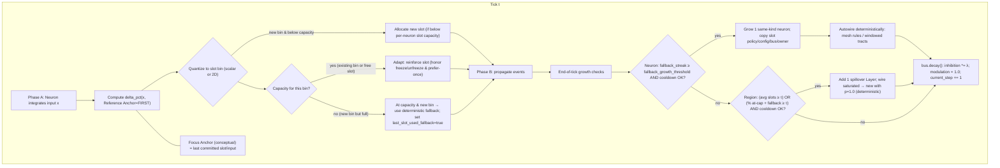

# GrowNet Golden Rule (Slot → Neuron → Layer → Region)

**Status:** Docs‑only. Default behavior unchanged.  
**Date:** 2025-10-01

> **Golden Rule:** *If new inputs are consistently outside what a unit already focuses on and local capacity is saturated, allocate new capacity exactly there; otherwise adapt what exists.*

This document states the **Adapt vs. Allocate** rule at the **neuron‑slot level first**, then shows how the **same rule** rolls up cleanly to **layers** and **regions** under GrowNet’s tick discipline, wiring invariants, and determinism constraints.

---

## TL;DR (operational)

- **Adapt**: Reinforce an existing slot when the input is **consistent** with current focus.  
- **Allocate**: If a **new slot** is needed but the neuron is at **strict capacity**, mark **fallback**. If **fallback persists** (streak ≥ threshold) and **cooldown** has elapsed, **grow one same‑kind neuron**. Region adds **one spillover layer** when aggregate pressure crosses its thresholds—**one growth per tick**.

**Targeted and bounded:** Growth is **local** (exactly where novelty manifests) and **rate‑limited** (capacity limits + cooldowns + end‑of‑tick growth).

---

## Diagram (Mermaid)



---

## Diagram (ASCII)

```
             +----------------------------------+
             | Phase A: integrate input x       |
             +-------------------+--------------+
                                 |
                 compute delta_pct(x, anchor_FIRST)
                                 |
                           quantize to slot k
                                 |
              +------------------+-------------------+
              |                                      |
   capacity?  | yes (existing/free bin)              | no (new bin but full)
              |                                      |
              v                                      v
   Adapt: reinforce slot                  Use deterministic fallback
 (honor freeze/unfreeze,                  -> set last_slot_used_fallback = true
  prefer_last_slot_once)
              |                                      |
              +------------------+-------------------+
                                 v
                     Phase B: propagate events
                                 v
                      End-of-tick growth checks
                                 |
           +---------------------+------------------------+
           |                      |                        |
           v                      v                        v
Neuron growth?          Region OR-trigger?           Otherwise
(fallback_streak        (avg slots >= τ OR           no growth;
 >= threshold AND         % at-cap+fallback >= τ)    proceed
 cooldown OK)             AND cooldown OK            to decay
   |                          | 
   v                          v
Grow 1 same-kind          Add 1 spillover Layer
neuron; copy config;      (p=1.0 spillover wiring)
deterministic autowiring
                                 v
        bus.decay(): inhibition *= λ; modulation=1.0; step++

```

---

## 1) Core objects & tick discipline

- **Region**: holds Layers, growth policy, mesh rules, (optional) **Tracts** for windowed wiring.  
- **Layer**: population of E/I/M neurons + shared **LateralBus**; may add neurons (same kind).  
- **Neuron**: owns **slot memory**, threshold dynamics, outgoing synapses.  
- **Slot**: scalar or 2D **delta‑from‑anchor** bins (fixed count; strict capacity).

**Tick discipline (all languages):**  
**phase_A** integrate → choose/reinforce slot → maybe fire → **phase_B** propagate → **end_tick** (`neuron.end_tick()` then `bus.decay()`; inhibition decays multiplicatively; modulation resets to 1.0; `current_step += 1`).

---

## 2) Anchor semantics (focus vs reference)

- **Focus Anchor (conceptual):** *“the last input we choose to focus on”*—the neuron’s **current focus** in narrative terms, reflected by the **slot we just committed**.  
- **Reference Anchor (implementation):** the **FIRST** observed template used to compute **delta‑percent** for binning. It remains fixed to give a **stable novelty reference**.

> These two views **coexist**: we speak about what the neuron focuses on using the **Focus** notion, while the math that selects bins uses the **FIRST** **Reference Anchor** for consistent deltas. No behavior change is implied by this definition.

---

## 3) Slot selection (scalar & 2D)

**Scalar** delta‑percent:
\[
\text{delta\_pct}(x,a) = \frac{|x-a|}{\max(|a|,\epsilon_\text{scale})} \times 100
\]

**2D**: independent row/col binning; pack \((\text{rowBin}, \text{colBin})\) → integer key (e.g., `row*100000 + col`).

**Capacity policy**: **strict** per‑neuron slot count. If a **new bin** is desired and capacity is free → **allocate slot** immediately. If **full**, use a **deterministic fallback** and set `last_slot_used_fallback = true` (novelty pressure signal).

**Freeze/Unfreeze**: `freeze_last_slot()` locks a slot; `unfreeze_last_slot()` enables **one‑shot** preference to reuse the same slot next tick (`prefer_last_slot_once` parity across languages).

---

## 4) Golden Rule at the neuron‑slot level

- **Adapt path** (consistency): commit/reinforce the chosen slot (respect freeze/unfreeze).  
- **Allocate path** (persistent novelty at saturation): if a new bin is needed but capacity is full, mark **fallback**. When **fallback occurs in a streak** and **cooldown** has elapsed → **grow one neuron of the same kind** at **end‑of‑tick**.

This is the front‑line “detect different → allocate different” behavior.

---

## 5) Growth: Slot → Neuron (same kind)

**Trigger (all required):**
1) **Strict slot capacity reached** for the seed neuron, and  
2) **Fallback streak** (consecutive ticks using fallback) ≥ `fallback_growth_threshold`, and  
3) **Cooldown** since last neuron growth ≥ `neuron_growth_cooldown_ticks`.

**Action:** add **one neuron of the same kind**, copying slot policy/config/limits/bus/owner. **Autowire deterministically** via **mesh rules** and/or **windowed tracts**. Enforce **one growth per tick**.

---

## 6) Roll‑up: Neuron/Layer → Region (add a layer)

At **end‑of‑tick**, a Region requests **one spillover layer** when (OR):

- **Average slots per neuron** ≥ `avg_slots_threshold`, **or**  
- **Percent of neurons** at capacity **and** using fallback ≥ `percent_at_cap_fallback_threshold`.

Respect Region caps (`max_layers`) and **layer_cooldown_ticks**. Wire **saturated → new** with **p = 1.0** (deterministic); record mesh rules for reproducibility.

> **Region‑level modularity** is supported; automatic cross‑region growth is a policy extension. The design keeps this separable from per‑tick reflexes.

---

## 7) Determinism, wiring, reproducibility

- **Mesh rules**: whenever `connect_layers(src, dst, p, feedback)` is called, record a rule; on neuron growth, replay inbound/outbound connections for new neurons deterministically.  
- **Windowed Tracts (2D)**: `connect_layers_windowed(...)`; on source‑layer neuron growth, re‑attach with `Tract.attach_source_neuron(new_idx)`; for `OutputLayer2D`, map each sliding window to its **center** target index.  
- **Spillover wiring**: `request_layer_growth` uses **p=1.0**.  
- **PAL v2**: ordered reduction preserves determinism across languages; worker bounds via per‑language knobs; seeds fixed.  
- **Clocking**: growth occurs after phase_B and before decay completes; cooldowns use the **bus clock (`current_step`)**.

---

## 8) Invariants & limits

- **One growth per tick** (Region; and per‑Layer in TypeScript).  
- **Strict slot capacity** per neuron; deterministic fallback under saturation.  
- **Cooldowns** limit growth rate.  
- **Best‑effort**: failure to grow never disrupts tick processing.  
- **Reproducibility**: deterministic RNG and wiring everywhere.

---

## 9) Metrics & tests (observability only)

**Per‑neuron**: slot occupancy histogram; `last_slot_used_fallback`; **fallback_streak**; last growth tick; cooldown remaining; anchor drift (Δ‖a‖/max(‖a_prev‖, ε)).

**Per‑layer/region**: average slots per neuron; percent (at capacity **and** fallback); growth events (id/type/parent); mesh‑replay sanity; synapse totals; optional routing entropy.

**Parity tests already in tree**: bus decay parity; **one‑growth‑per‑tick**; windowed wiring smoke; PAL determinism; 2D/ND tick smoke; spatial metrics wrapper.

---

## 10) Worked example (digits → letters)

- A neuron’s **focus** captures a top‑left loop (helps “3/8”).  
- Letter **“A”** arrives; the required bin is new:  
  - **If capacity available** → allocate the slot (**adapt within neuron**).  
  - **If at capacity** → **fallback** is used and flagged.  
- **Fallback streak** (while at capacity) triggers **one neuron growth** at end‑of‑tick.  
- Mesh rules replay wiring; the new neuron specializes on A’s apex/legs; parent retains the loop skill. Region adds a layer only if many neurons show similar pressure.

**Golden Rule satisfied**: novelty ⇒ new capacity, targeted and bounded.

---

## 11) Config surface (no default changes)

```yaml
slot_selection:
  anchor_mode: FIRST       # conceptual focus can be “last input we choose to focus on”;
                           # binning still uses FIRST as the reference anchor
  scalar:
    epsilon_scale: 1e-6
    bin_width_pct: 5       # example; project-specific
  two_d:
    # separate row/col binning; pack (row, col) -> key

growth_rules:
  slots_to_neuron:
    fallback_growth_threshold: 3
    neuron_growth_cooldown_ticks: 0
  neuron_to_layer:
    avg_slots_threshold: <project-specific>
    percent_at_cap_fallback_threshold: <project-specific>
    layer_cooldown_ticks: <project-specific>
    max_layers: <project-specific>
```

---

## 12) Cross‑language parity & style

- **Python & Mojo**: no leading underscores in public names; typed params in Mojo; strict capacity + fallback; `prefer_last_slot_once`; ND path; windowed tracts; spatial metrics wrapper.  
- **C++**: `SlotEngine` strict capacity + fallback; `preferLastSlotOnce` honored; `currentStep` increments in `decay()`; growth knobs in `SlotConfig`; mesh rules recorded; OpenMP PAL v2 ordered reduction; spatial metrics wrapper.  
- **Java**: slot engine with fallback & one‑shot reuse; GrowthPolicy with OR‑trigger (`avgSlotsThreshold`, `% at‑cap+fallback`) and cooldown; deterministic region growth & mesh rules; windowed wiring; PAL v2 with Virtual Threads; spatial metrics wrapper.  
- **TypeScript**: strict capacity/fallback; per‑Layer auto‑growth (one per layer per tick); Region OR‑trigger + cooldown; mesh replay; windowed wiring; spatial metrics; PAL determinism tests.

**Naming:** Java/C++ public API = camelCase/PascalCase (no snake_case). Python/Mojo = avoid leading underscores. Seeds deterministic where present. Spillover wiring uses **p=1.0** unless a policy overrides.

---

## 13) Rollout plan (safe by default)

1) **Phase 0 (observe only):** enable counters/logs; no thresholds adjusted.  
2) **Phase 1 (neuron growth tuning):** keep Region growth off; tune `fallback_growth_threshold` and cooldowns with budgets.  
3) **Phase 2 (layer growth enable):** enable Region OR‑triggers with caps; verify one‑growth‑per‑tick; run parity/stress tests.

---

## 14) Review checklist (copy into PR)

- [ ] **Sloting:** delta‑percent against the FIRST Reference Anchor; strict per‑neuron capacity.  
- [ ] **Fallback:** new‑bin‑desired while at capacity sets `last_slot_used_fallback` and increments streak.  
- [ ] **Neuron growth:** streak ≥ `fallback_growth_threshold` **and** cooldown satisfied ⇒ grow 1 same‑kind neuron (end‑of‑tick).  
- [ ] **Layer growth:** Region OR‑trigger (avg slots threshold **or** % at‑cap+fallback) + cooldown + caps; **p=1.0** spillover.  
- [ ] **Determinism:** mesh rules replay; windowed tracts re‑attach; PAL v2 ordered reduction.  
- [ ] **Invariants:** one‑growth‑per‑tick observed; bus `current_step` increments on decay.  
- [ ] **Metrics:** fallback flags/streaks and growth events visible in logs.

---

## Appendix A: (Docs‑only) reference pseudocode

```python
# Docs-only pseudocode for the Golden Rule gate at neuron-slot level.
# Real code follows project style, naming, and language-specific APIs.

def choose_slot_and_apply(x, anchor_first, slots, capacity, state, cfg):
    delta_pct = 100.0 * abs(x - anchor_first) / max(abs(anchor_first), cfg.epsilon_scale)
    k = quantize(delta_pct, cfg.bin_edges_pct)  # scalar or packed 2D key

    if k in slots or len(slots) < capacity:
        # Adapt path
        commit_slot(k)                 # reinforce; honors freeze/unfreeze
        state.last_slot_used_fallback = False
    else:
        # Saturated novelty path
        k = deterministic_fallback_id()
        commit_slot(k)
        state.last_slot_used_fallback = True
        state.fallback_streak += 1

def maybe_grow_neuron(state, layer, cfg, bus):
    # Checked at end-of-tick
    if (state.at_capacity
        and state.fallback_streak >= cfg.fallback_growth_threshold
        and bus.current_step - state.last_growth_step >= cfg.neuron_growth_cooldown_ticks):
        layer.add_same_kind_neuron(seed=self)     # copies config/limits/bus/owner
        replay_mesh_rules_and_windowed_tracts()
        state.last_growth_step = bus.current_step
        state.fallback_streak = 0
```

---

**Relative link:** `docs/GOLDEN_RULE.md`  
**Add to READ_ORDER:** place immediately after the architecture overview.
